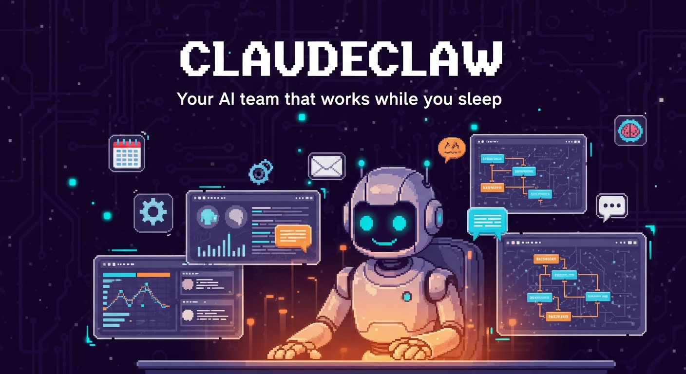

# ClaudeClaw

<p align="center">
  
</p>

[](https://nodejs.org/)
[](https://www.typescriptlang.org/)
[](https://www.sqlite.org/)
[](https://claude.ai/code)
[](https://ollama.com/)
[](https://core.telegram.org/bots)
[](LICENSE)

**AI multi-agent framework built on Claude Code** — your personal AI team that works while you sleep.

A self-hosted AI assistant framework with a web dashboard, memory system, Telegram integration, voice I/O, MCP catalog, and 28 schedule types. Built for solopreneurs, freelancers, and small teams who want their own AI workforce.

> **Multilingual** — Full HU/EN language switcher with 200+ translations. Dashboard defaults to Hungarian but works in any language.

---

## What is ClaudeClaw?

ClaudeClaw turns Claude Code into a full AI assistant platform:

- **AI Team Management** — Create multiple agents, each with their own personality, skills, and Telegram bot
- **Agent Teams** — Parallel sub-agents with worktree isolation, coordinated task execution
- **Mission Control Dashboard** — Web UI: home overview, kanban, memory, schedules, skills, connectors, daily log, chat
- **HU/EN Language Switcher** — 200+ translated strings, one-click toggle, persistent preference
- **Real-time Chat** — Two-way chat with agents from the dashboard (Claude SDK powered, session history)
- **Voice I/O** — Whisper STT + ElevenLabs TTS (Hungarian voice support)
- **Telegram Integration** — Native Claude Code Channels plugin with Telegram slash commands
- **MCP Catalog** — 18 MCP servers organized by category, one-click install and configure
- **Billingo MCP** — Native Hungarian invoicing integration (35+ tools)
- **PostgreSQL MCP** — Direct database queries from the dashboard
- **Context7 MCP** — Fresh framework documentation lookup
- **Skill Browser** — 55+ skills with categories, search, AI generation, built-in editor
- **Skill Factory** — Meta-skill that generates new skills from natural language descriptions
- **Progressive Disclosure** — 3-level skill loading (essential / on-demand / deep)
- **Memory System** — Hot/Warm/Cold/**Shared** 4-tier memory with **dynamic promote/demote**, vector search, **dream cycle consolidation**, heartbeat (30 min), PreCompact auto-save
- **Smart Scheduling** — 28 schedule types (morning briefing, email monitor, lead alerts, SEO audit, financial summary, weekly report, and more)
- **Kanban Board** — Labels, color coding, blocked-by dependencies, agent task assignment
- **Inter-Agent Communication** — Message queue between agents, task delegation
- **Webhook Endpoint** — Connect n8n, Zapier, or any external service
- **Playwright** — Built-in browser automation (screenshots, scraping, testing)
- **Ultrathink Mode** — Extended reasoning for complex multi-step tasks
- **Imagen 4 Ultra** — AI banner and image generation
- **Dark/Light Mode** — Theme toggle with persistent preference
- **Mobile Responsive** — Hamburger navigation, horizontal kanban scroll, touch-friendly
- **Daily Log** — Automatic session summaries, browsable by date
- **Hooks** — PreCompact, PostCompact, and Stop hooks for lifecycle management
- **MCP Connectors** — Dynamic discovery from claude.ai (Gmail, Calendar, Asana, Figma, Canva, n8n, etc.)

---

## Features in Detail

### Multi-Agent System
- Create agents from the dashboard with AI-generated personalities (CLAUDE.md + SOUL.md)
- Each agent gets their own skills directory, optional Telegram bot, and model selection
- **Agent Teams**: spawn parallel sub-agents in isolated worktrees for concurrent task execution
- Start/stop agents independently (tmux sessions)
- Agents communicate via message queue (5-second polling)
- Agent-specific kanban task views (`/api/kanban/agent/:name`)

### Voice I/O
- **Whisper STT** — Speech-to-text via OpenAI Whisper, supports Hungarian
- **ElevenLabs TTS** — Text-to-speech with multiple voices (including Hungarian)
- Push-to-talk from the dashboard chat widget

### MCP Catalog
- **18 pre-configured MCP servers** across 7 categories (search, productivity, development, AI, finance, communication, design)
- One-click install — just add your API key
- Includes: Brave Search, Notion, GitHub, GitLab, Slack, Discord, Figma, Google Maps, ElevenLabs, OpenAI, Stability AI, Grafana, Neon, and more
- **Billingo MCP** — Native Hungarian invoicing (35+ tools: invoices, partners, expenses, reports)
- **PostgreSQL MCP** — Direct SQL queries against your database
- **Context7 MCP** — Always up-to-date framework documentation

### Skill System
- **55+ skills** organized by category (marketing, finance, automation, development, design, etc.)
- **Skill browser** with search, category filtering, and detail view
- **Skill Factory** — Meta-skill: describe what you need in natural language, AI writes the SKILL.md
- **Skill editor** — Edit skills directly from the dashboard
- **Progressive disclosure** — 3-level loading: essential skills always loaded, on-demand loaded by context, deep skills loaded on explicit request
- Skills auto-loaded by Claude Code at session start

### Kanban Board
- Four columns: Planned, In Progress, Waiting, Done
- **Labels** with color coding (tech, business, urgent, idea, etc.)
- **Blocked-by dependencies** — Cards show blocked status, auto-unblock when dependency is done
- **Agent tasks** — Assign cards to specific agents
- Priority levels (low, normal, high, urgent)
- Drag-and-drop, assignees, due dates, comments
- Auto-archive done cards after 30 days
- **Mobile**: horizontal scroll, touch-friendly drag

### Memory Architecture
| Tier | Purpose | Example |
|------|---------|---------|
| **Hot** | Active tasks, pending decisions | "Client X needs a response today" |
| **Warm** | Stable config, preferences | "Owner prefers short responses" |
| **Cold** | Long-term learnings | "We switched from X to Y because..." |
| **Shared** | Cross-agent knowledge | "The VPS IP is..." |

- **FTS5 full-text search** — Fast keyword search on content and keywords
- **Vector search** — Ollama + nomic-embed-text (768-dim), cosine similarity
- **Hybrid search** — FTS5 + vector + Reciprocal Rank Fusion (RRF, k=60)
- **Salience decay** — Memories fade naturally (0.995×/day) but never auto-delete
- **Dream cycle** — 4-phase daily memory consolidation pipeline (see [Dream cycle](#dream-cycle) below)
- **Auto-promote warm→hot** — when salience ≥3.0 AND accessed within 24h
- **Auto-promote warm→shared** — content-based detection (mentions of other agents or shared-memory keywords)
- **Hot→warm demote** — on `salience <2.0 OR accessed_at <3 days ago` (age alone doesn't demote)
- **Memory heartbeat** — Every 30 minutes, auto-saves important session context
- **PreCompact hook** — Automatically saves important context before Claude compacts
- **PostCompact hook** — Runs after compaction to restore critical state
- **Stop hook** — Saves session summary when agent stops


### Dream cycle

Background job that runs per agent (configurable schedule) to consolidate memories and generate insights. Each run produces a `DreamReport` with counts per phase.

| Phase | Name | What it does |
|-------|------|--------------|
| **0** | `decay` | Global salience decrement `0.995×/day` across all memories — unused records fade naturally, never auto-delete |
| **1** | `lightSleep` | Jaccard similarity (`>0.6`) clustering on the agent's hot tier, merges near-duplicates keeping the highest-salience record |
| **2** | `REM insights` | LLM analyzes the last-24h hot + top-15 warm memories (by salience), generates 1–3 actionable insights stored as new warm records tagged `dream-insight` |
| **3** | `deepSleep` | Tier promote/demote, cold cleanup, touch-log retention (30 days) |

**Phase 3 tier transitions:**
- `warm → hot` — when salience `≥3.0` AND accessed within 24h
- `warm → shared` — when content mentions other agent names or shared-memory keywords (`csapat összefoglaló`, `közös memória`, `shared memory`, `minden agent`)
- `hot → warm` — when salience `<2.0` OR accessed `>3 days ago` (age alone does not demote)

Report shape: `{ phase0: { decayed }, phase1: { clustersFound, memoriesMerged, memoriesRemoved }, phase2: { insightsGenerated }, phase3: { hotPromoted, sharedPromoted, demoted, coldCleaned, touchLogCleaned } }`

### Scheduling System
- **28 schedule types** including:
  - Morning briefing (weather, calendar, emails, tasks)
  - Email monitoring (important mail detection, lead alerts)
  - SEO audit and content checks
  - Financial summary and invoice reminders
  - Weekly/monthly reports
  - Social media scheduling
  - Server health checks
  - Custom cron expressions
- **Tasks** — Always notify with results
- **Heartbeats** — Silent checks, only notify when something important happens
- Cron expression support with visual editor
- Agent assignment (including broadcast to all agents)
- Smart prompt expansion wizard with AI-powered refinement

### Dashboard Pages
| Page | Description |
|------|-------------|
| **Home** | Overview dashboard — agent status, recent activity, quick stats, system summary |
| **Kanban** | Task board with drag-and-drop, labels, dependencies, priorities |
| **Team** | Agent management — create, configure, start/stop, avatar, Telegram |
| **Schedules** | List, daily timeline, and weekly views for cron tasks |
| **Skills** | 55+ skill browser with categories, search, AI generation, editor |
| **Memory** | Hot/Warm/Cold tabs, hybrid search, graph view |
| **Daily Log** | Session logs by date, agent filter, auto-generated summaries |
| **Connectors** | MCP catalog (18 servers), one-click install, dynamic discovery |
| **Status** | Claude service health (active incidents only) |
| **Chat** | Real-time two-way chat with agents (floating widget, voice support) |

### Ultrathink Mode
- Extended reasoning for complex multi-step tasks
- Activates deeper Claude analysis with chain-of-thought
- Useful for architecture decisions, debugging, and planning

### Dark/Light Mode
- One-click theme toggle
- Persistent preference (localStorage)
- All dashboard pages and components fully themed

### Mobile Responsive
- Hamburger navigation menu
- Horizontal kanban scroll with touch support
- Responsive cards, forms, and modals
- Works on phones and tablets

### Security
- Dashboard protected by Bearer token (auto-generated on first start)
- **URL fragment-based auth token** (not query string — avoids server/proxy logs)
- **Webhook shared-secret auth** (`X-Webhook-Secret` header, constant-time compare)
- CORS origin whitelist
- Security headers (X-Frame-Options, X-Content-Type-Options)
- **Path traversal protection** (agent name sanitization + `safeJoin` for agent directories)
- **`execFile` (no shell) for tmux send-keys** — prevents command injection
- **Cron shape validation** — rejects malformed schedule expressions
- **LIKE wildcard escape** on memory search (prevents `q='%'` = all records)
- **Trusted-peer prompt-safety wrapper** for inter-agent messages
- Model name validation (command injection protection)
- **Anthropic Agent SDK** (latest, CVE-patched — replaces deprecated claude-code 1.x)

---

## Quick Start

### Prerequisites
- **Node.js 20+**
- **Linux** (Ubuntu 22.04/24.04 recommended) or macOS
- **Claude Code** installed and authenticated
- **Telegram bot token** (from @BotFather) — optional but recommended
- **Ollama** with `nomic-embed-text` — optional, for vector search

### Installation

```bash
# Clone
git clone https://github.com/doboimre86/claudeclaw-public.git
cd claudeclaw

# Install dependencies
npm install

# Configure
cp .env.example .env
# Edit .env with your values

# Build
npx tsc

# Create your agent personality
cp templates/CLAUDE.md.template CLAUDE.md
# Edit CLAUDE.md — customize name, personality, rules

# Start
node dist/index.js
```

Dashboard: `http://localhost:3420`

First start — check console for access URL:
```
Dashboard access URL: http://127.0.0.1:3420/?token=YOUR_TOKEN_HERE
```

### Telegram Setup

1. Create a bot with @BotFather
2. Add token to `.env`: `TELEGRAM_BOT_TOKEN=your_token`
3. Start with channels:
```bash
claude --channels plugin:telegram@claude-plugins-official
```

### Production (systemd)

```bash
# Dashboard service
sudo tee /etc/systemd/system/claudeclaw-dashboard.service << 'EOF'
[Unit]
Description=ClaudeClaw Dashboard
After=network.target

[Service]
Type=simple
WorkingDirectory=/path/to/claudeclaw
ExecStart=/usr/bin/node dist/index.js
Restart=always
RestartSec=5
Environment=NODE_ENV=production
MemoryMax=512M

[Install]
WantedBy=multi-user.target
EOF

sudo systemctl enable --now claudeclaw-dashboard
```

### HTTPS with Traefik

```yaml
http:
  routers:
    claudeclaw:
      rule: "Host(`your-domain.com`)"
      service: claudeclaw
      entryPoints: [websecure]
      tls:
        certResolver: letsencrypt
  services:
    claudeclaw:
      loadBalancer:
        servers:
          - url: "http://127.0.0.1:3420"
```

---

## Configuration

### Environment Variables

| Variable | Required | Default | Description |
|----------|----------|---------|-------------|
| `OWNER_NAME` | Yes | User | Your name (used in greetings) |
| `TELEGRAM_BOT_TOKEN` | No | — | Telegram bot token |
| `ALLOWED_CHAT_ID` | No | — | Your Telegram user ID |
| `WEB_PORT` | No | 3420 | Dashboard port |
| `OLLAMA_URL` | No | localhost:11434 | Ollama server URL |
| `DASHBOARD_TOKEN` | No | auto-generated | Fixed dashboard auth token |
| `BILLINGO_API_KEY` | No | — | Billingo invoicing API key |
| `BRAVE_API_KEY` | No | — | Brave Search API key |
| `OPENAI_API_KEY` | No | — | OpenAI API key (for Whisper STT) |
| `ELEVENLABS_API_KEY` | No | — | ElevenLabs API key (for TTS) |
| `HEARTBEAT_CALENDAR_ID` | No | — | Google Calendar ID for heartbeat |

### CLAUDE.md — Agent Personality

The core configuration file. Loaded into every Claude session. Customize:
- Agent name and personality
- Rules and boundaries (e.g., "never send emails without approval")
- Memory system instructions
- Available skills list
- Business context

See `templates/CLAUDE.md.template` for a complete example.

### Skills

Place skill files in `.claude/skills/`:
```
.claude/skills/
  my-skill/
    SKILL.md          # With YAML frontmatter
  quick-skill.md      # Single-file skill
```

Skills are auto-loaded by Claude Code and visible in the dashboard.

---

## API Reference

All endpoints return JSON. Auth: `Authorization: Bearer TOKEN` header.

### Public (no auth)
| Method | Path | Description |
|--------|------|-------------|
| GET | `/api/health` | Health check (uptime, memory, DB status) |
| POST | `/api/webhook` | Webhook receiver for external services |

### Core
| Method | Path | Description |
|--------|------|-------------|
| POST | `/api/chat` | Chat with agent (returns AI reply) |
| GET | `/api/status` | Claude service status |

### Agents
| Method | Path | Description |
|--------|------|-------------|
| GET | `/api/agents` | List all agents |
| POST | `/api/agents` | Create agent (AI generates CLAUDE.md + SOUL.md) |
| GET/PUT/DELETE | `/api/agents/:name` | Agent CRUD |
| POST | `/api/agents/:name/start` | Start tmux session |
| POST | `/api/agents/:name/stop` | Stop tmux session |
| POST | `/api/agents/:name/telegram` | Configure Telegram bot |

### Memory
| Method | Path | Description |
|--------|------|-------------|
| GET | `/api/memories` | Search (?q=, ?agent=, ?tier=, ?mode=hybrid) |
| POST | `/api/memories` | Save memory (agent_id, content, tier, keywords) |
| PUT/DELETE | `/api/memories/:id` | Update/delete |
| GET | `/api/memories/stats` | Statistics (total, by agent, by tier) |
| POST | `/api/memories/backfill` | Generate embeddings for all memories |

### Kanban
| Method | Path | Description |
|--------|------|-------------|
| GET | `/api/kanban` | List cards (auto-archives done >30 days) |
| POST | `/api/kanban` | Create card (title, status, priority, assignee) |
| PUT/DELETE | `/api/kanban/:id` | Update/delete card |
| POST | `/api/kanban/:id/comments` | Add comment |
| GET | `/api/kanban/agent/:name` | Cards assigned to agent |

### Schedules
| Method | Path | Description |
|--------|------|-------------|
| GET | `/api/schedules` | List all schedules |
| POST | `/api/schedules` | Create (name, prompt, schedule, agent, type) |
| PUT/DELETE | `/api/schedules/:name` | Update/delete |
| POST | `/api/schedules/:name/toggle` | Enable/disable |

### Daily Log
| Method | Path | Description |
|--------|------|-------------|
| GET | `/api/daily-log` | Get entries (?agent=, ?date=) |
| POST | `/api/daily-log` | Add entry (agent_id, content) |

### Connectors
| Method | Path | Description |
|--------|------|-------------|
| GET | `/api/connectors` | List MCP servers (cached 60s) |
| POST | `/api/connectors` | Add MCP server |
| DELETE | `/api/connectors/:name` | Remove MCP server |

---

## Architecture

```
You (Telegram / Dashboard Chat / Voice)
    |
    v
Claude Code Session (CLAUDE.md context)
    |                              |
    v                              v
Tools, MCP,                  ClaudeClaw Backend
Skills, Bash,                 - Memory (SQLite + FTS5 + vectors)
Agent Teams                   - Kanban board
                              - Heartbeat monitor (30 min)
                              - Inter-agent messages
                              - Cron scheduler (28 types)
                              - Web dashboard :3420
                              - Webhook endpoint
                              - MCP Catalog (18 servers)
                              - Voice (Whisper + ElevenLabs)
                              - Playwright browser automation
```

### Tech Stack
- **Backend**: Node.js + TypeScript (native http, no Express)
- **Database**: SQLite (better-sqlite3, WAL mode, FTS5)
- **Frontend**: Vanilla HTML/CSS/JS (no build step, dark/light theme)
- **Vector Search**: Ollama + nomic-embed-text (optional)
- **Telegram**: Claude Code Channels plugin
- **Chat**: Claude Code SDK (@anthropic-ai/claude-code)
- **Voice**: Whisper STT + ElevenLabs TTS
- **MCP**: 18 pre-configured servers + dynamic discovery
- **Browser**: Playwright (screenshots, scraping, testing)
- **Logging**: Pino (structured JSON)
- **i18n**: HU/EN with 200+ translations

---

## FAQ

**What Claude model does it use?**
Whatever your Claude Code subscription provides. Claude Max = Opus 4.6 (1M context).

**Can I use it without Telegram?**
Yes. The dashboard chat widget works standalone with voice support.

**Does it work on macOS?**
Yes. Scripts support both systemd (Linux) and launchctl (macOS).

**How much does it cost?**
ClaudeClaw is free. You need a Claude Code subscription for the AI backend.

**Is data stored locally?**
Yes. SQLite database, local filesystem. Nothing sent externally except Claude API calls.

**Can I use it in English?**
Yes. Click the HU/EN toggle in the dashboard header. All 200+ UI strings are translated.

**What are Agent Teams?**
Parallel sub-agents that work in isolated git worktrees. Useful for splitting large tasks across multiple Claude instances.

**What is Ultrathink mode?**
Extended reasoning mode that activates deeper chain-of-thought analysis for complex tasks.

---

## Contributing

1. Fork the repository
2. Create a feature branch
3. Run tests: `npx vitest run`
4. Submit a pull request

---

## License

MIT License

---

## Credits

Built with [Claude Code](https://claude.ai/code) by Anthropic.

Inspired by [Marveen](https://github.com/Szotasz/marveen) AI team framework.

---

# ClaudeClaw (Magyar)

**AI multi-agent keretrendszer Claude Code-ra építve** — a személyes AI csapatod, ami dolgozik amíg te alszol.

Saját szerveren futó AI asszisztens keretrendszer web dashboarddal, memória rendszerrel, Telegram integrációval, hang I/O-val, MCP katalógussal és 28 ütemezési típussal.

---

## Mire jó?

### Személyes AI asszisztens
- **Reggeli briefing**: időjárás, naptár, emailek, teendők — automatikusan minden reggel
- **Email figyelés**: fontos levelek szűrése, lead észlelés (2 óránként)
- **Naptár kezelés**: Google Calendar események, emlékeztetők
- **Dokumentumok**: szerződés, számla, ajánlat, PDF generálás
- **Hang I/O**: Whisper beszédfelismerés + ElevenLabs felolvasó (magyar hang)

### Üzleti automatizálás
- **Számlakezelés**: Billingo MCP integráció (35+ eszköz)
- **Hírlevél**: MailerLite / saját platform
- **CRM**: Lead követés, ügyfél nyilvántartás
- **SEO**: Weboldal audit, kulcsszó követés
- **Pénzügy**: pénzváltási összevetés, kiadás követés

### Fejlesztés
- **Kód review** és javaslatok
- **Agent Teams**: párhuzamos sub-agentek worktree izolációban
- **Deployment**: Git workflow
- **Monitoring**: Szerver és szolgáltatás figyelés
- **Playwright**: böngésző automatizálás (screenshot, scraping, tesztelés)

### Marketing
- **Copywriting**: Landing page, email, hirdetés
- **Social media**: Poszt generálás
- **Blog**: WordPress írás és publikálás
- **Piackutatás**: Versenytárs elemzés
- **Imagen 4 Ultra**: AI banner és képgenerálás

---

## Hogyan működik?

1. **Telepítsd** a szerveredre
2. **Konfiguráld** (.env + CLAUDE.md)
3. **Indítsd el** — dashboard: `localhost:3420`
4. **Beszélj** az agenseddel Telegramon, dashboard chat-ben, vagy hangüzenettel

Az agens:
- Beolvassa a memóriát (mit tud rólad)
- Végrehajtja a feladatot (email, fájl, keresés, API)
- Válaszol és elmenti amit tanult

---

## Memória rendszer

4 szintű memória + dinamikus tiering + automatikus tanulás:

| Szint | Cél | Példa |
|-------|-----|-------|
| **Hot** | Aktív, sürgős | „Ma délután megbeszélés" |
| **Warm** | Stabil információk | „Tömör válaszokat szeret" |
| **Cold** | Hosszú távú | „Azt tanultam, hogy..." |
| **Shared** | Agentek közti tudás | „A VPS IP címe..." |

- **Álom ciklus**: 4 fázisú napi memória konszolidáció (lásd lent: [Álom ciklus](#%C3%A1lom-ciklus))
- **Automatikus warm→hot előléptetés**: ha salience ≥3.0 ÉS 24 órán belül használt
- **Automatikus warm→shared előléptetés**: tartalom-alapú detekcióval (más agentek említése, közös memória kulcsszavak)
- **Hot→warm visszafokozás**: ha `salience <2.0 VAGY >3 napja nem volt használva` (kor önmagában nem fokoz vissza)
- **Salience lepusztulás**: rekordok természetesen halványulnak (0,995×/nap), de sosem törlődnek automatikusan
- **FTS5 teljes szöveges keresés**: gyors kulcsszavas keresés
- **Vektor keresés**: Ollama + nomic-embed-text (768-dim), koszinusz hasonlóság
- **Hibrid keresés**: FTS5 + vektor + Reciprocal Rank Fusion (RRF, k=60)
- **Memory heartbeat**: 30 percenként automatikusan menti a fontos kontextust
- **PreCompact hook**: session tömörítés előtt automatikusan menti a fontosat
- **PostCompact hook**: tömörítés után visszaállítja a kritikus állapotot
- **Stop hook**: session összefoglaló mentés leálláskor
- **Napi összefoglaló**: 23:00-kor

---

## Biztonság

- Dashboard Bearer tokennel védve (első indításkor auto-generált)
- **URL fragment alapú auth token** (nem query string — nem kerül szerver/proxy logba)
- **Webhook megosztott titok auth** (`X-Webhook-Secret` header, konstans idejű összehasonlítás)
- CORS origin whitelist
- Biztonsági headerek (X-Frame-Options, X-Content-Type-Options)
- **Path traversal védelem** (agent név szanitizálás + `safeJoin` agent mappákhoz)
- **`execFile` (shell nélkül) a tmux send-keys-nél** — command injection védelem
- **Cron forma validáció** — hibás ütemezési kifejezések elutasítása
- **LIKE wildcard escape** a memória keresésen (megakadályozza `q='%'` = minden rekord)
- **Megbízható-peer prompt-safety wrapper** az agent-közötti üzenetekhez
- Model név validáció (command injection védelem)
- **Anthropic Agent SDK** (legújabb, CVE-patch-elt — a deprecated claude-code 1.x helyett)

---

## Álom ciklus

Háttér-folyamat, amely agens-enként fut (ütemezés konfigurálható) a memóriák konszolidálásához és felismerések generálásához. Minden futás egy `DreamReport` objektumot ad vissza fázisonkénti számlálókkal.

| Fázis | Név | Mit csinál |
|-------|-----|------------|
| **0** | `decay` | Globális salience csökkentés `0,995×/nap` minden rekordon — a használaton kívüli emlékek természetesen halványulnak, de sosem törlődnek automatikusan |
| **1** | `lightSleep` | Jaccard hasonlóság (`>0,6`) klaszterezés az agens hot tier-jén, a közeli duplikátumokat egyesíti a legmagasabb salience-ű rekord megtartásával |
| **2** | `REM insights` | LLM elemzi az utolsó 24 óra hot + top-15 warm memóriákat (salience szerint), 1–3 konkrét felismerést generál új warm rekordként `dream-insight` taggel |
| **3** | `deepSleep` | Tier előléptetés/visszafokozás, cold takarítás, touch-log retenció (30 nap) |

**3. fázis tier-átmenetek:**
- `warm → hot` — ha salience `≥3,0` ÉS 24 órán belül használt
- `warm → shared` — ha a tartalom más agens nevét vagy közös-memória kulcsszót említ (`csapat összefoglaló`, `közös memória`, `shared memory`, `minden agent`)
- `hot → warm` — ha salience `<2,0` VAGY `>3 napja nem használt` (kor önmagában nem fokoz vissza)

Report alakja: `{ phase0: { decayed }, phase1: { clustersFound, memoriesMerged, memoriesRemoved }, phase2: { insightsGenerated }, phase3: { hotPromoted, sharedPromoted, demoted, coldCleaned, touchLogCleaned } }`

---

## Dashboard oldalak

| Oldal | Funkció |
|-------|---------|
| **Főoldal** | Összefoglaló — agens státusz, aktivitás, gyors statisztikák |
| **Kanban** | Feladattábla (drag-and-drop, címkék, függőségek, prioritás, mobil scroll) |
| **Csapat** | Agensek kezelése, Telegram, indítás/leállítás, Agent Teams |
| **Ütemezések** | 28 típus: reggeli briefing, email, lead, SEO, pénzügyi, heti riport stb. |
| **Skillek** | 55+ skill böngésző, kategóriák, keresés, AI generálás, Skill Factory, szerkesztő |
| **Memória** | Hot/Warm/Cold/Shared fülek, hibrid keresés, grafikon |
| **Napi napló** | Session összefoglalók dátum szerint, agens szűrő |
| **Connectorok** | MCP katalógus (18 szerver), egy kattintás telepítés |
| **Release** | Publikus release állapot (utolsó release + várakozó commitok) |
| **Státusz** | Claude szolgáltatás állapota (csak aktív incidensek) |
| **Chat** | Kétirányú chat az agenssel (lebegő widget, hangüzenet) |

---

## MCP Katalógus

18 előrekonfigurált MCP szerver 7 kategóriában:

| Kategória | Szerverek |
|-----------|-----------|
| **Keresés** | Brave Search, Google Maps, Exa, Tavily, Firecrawl |
| **Produktivitás** | Notion, Google Calendar, Linear, Airtable, Trello |
| **Fejlesztés** | GitHub, GitLab, Neon, Grafana, PostgreSQL |
| **AI** | ElevenLabs, OpenAI, Stability AI, Context7 |
| **Pénzügy** | Billingo (35+ eszköz), Wise, QuickBooks, Stripe |
| **Kommunikáció** | Slack, Discord |
| **Design** | Figma |

---

## Nyelvi kapcsoló (i18n)

- **HU/EN** váltás egy kattintással a fejlécben
- **200+ fordított szöveg** (menük, gombok, státuszok, hibaüzenetek)
- Beállítás megmarad (localStorage)
- Az agens nyelve függetlenül állítható a CLAUDE.md-ben

---

## Rendszerkövetelmények

- Node.js 20+
- Linux (Ubuntu ajánlott) vagy macOS
- Claude Code (telepítve, autentikálva)
- Telegram bot (opcionális)
- Ollama + nomic-embed-text (opcionális)

---

## Telepítés

```bash
git clone https://github.com/doboimre86/claudeclaw-public.git
cd claudeclaw
npm install
cp .env.example .env    # szerkeszd a saját adataiddal
npx tsc
cp templates/CLAUDE.md.template CLAUDE.md  # szabd testre
node dist/index.js
```

---

## Licenc

MIT

---

## Kapcsolat

- [GitHub Issues](https://github.com/doboimre86/claudeclaw-public/issues)
